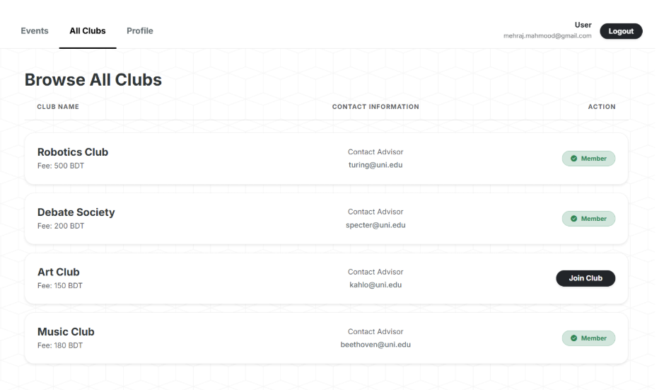
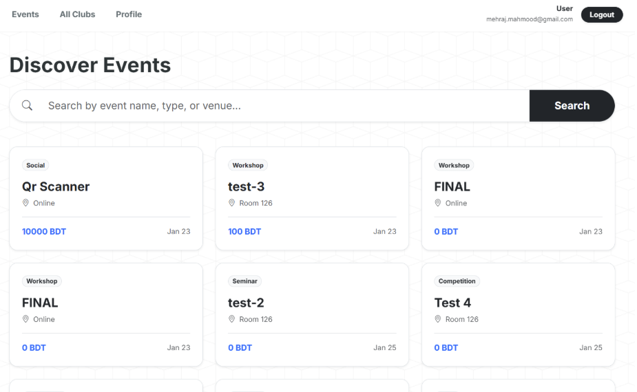
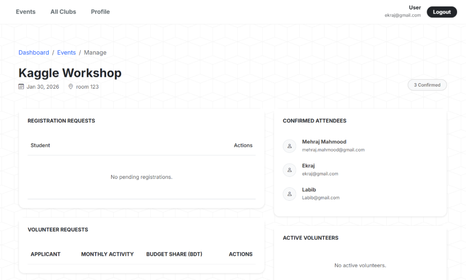
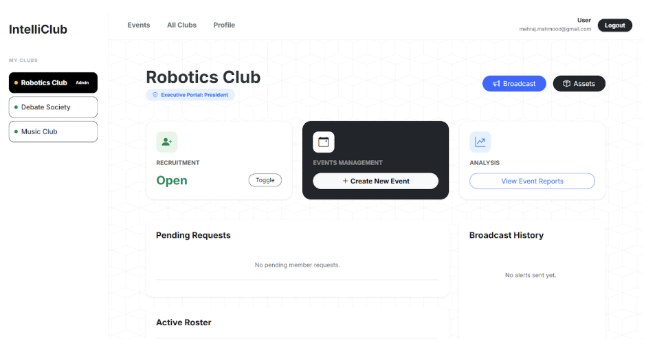
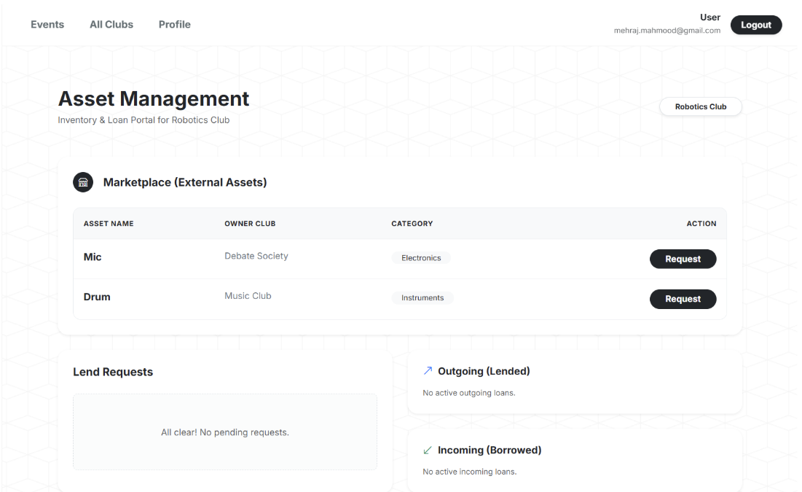
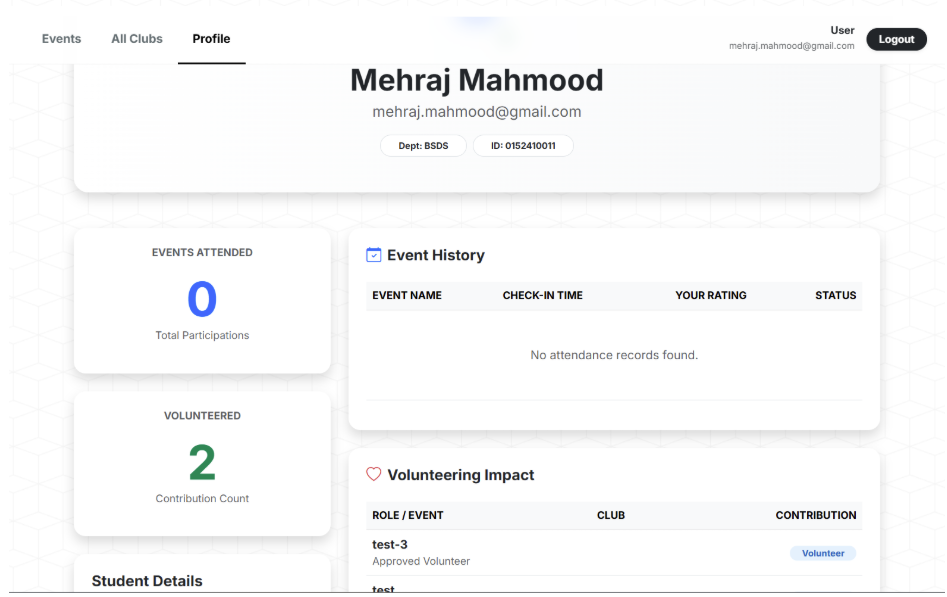

# IntelliClub 🎓

<div align="center">

**A Comprehensive Club Management System for Universities**

*CSE 3522 - Database Management Systems Laboratory*  
*United International University*

</div>

---

## 📋 Table of Contents
- [About the Project](#-about-the-project)
- [Features](#-features)
- [Technology Stack](#-technology-stack)
- [Database Schema](#-database-schema)
- [Prerequisites](#-prerequisites)
- [Installation & Setup](#-installation--setup)
- [Running the Application](#-running-the-application)
- [Database Setup](#-database-setup)
- [Project Structure](#-project-structure)
- [Screenshots](#-screenshots)
- [Contributors](#-contributors)

---

## 🎯 About the Project

**IntelliClub** is a comprehensive club management system designed specifically for university environments. It provides a centralized platform for managing multiple clubs, organizing events, tracking membership, handling asset management, and maintaining financial records. Built as a semester project for the Database Management Systems Laboratory course, this system demonstrates practical implementation of database concepts and web application development.

The system serves three primary user roles:
- **Students**: Browse clubs, register for membership, participate in events
- **Club Executives**: Manage club operations, organize events, track members
- **System Administrators**: Oversee all clubs and manage system-wide settings

---

## ✨ Features

### 👥 Club Management
- Create and manage multiple university clubs
- Track club funds and registration fees
- Maintain advisor information and club details
- Control club registration status (open/closed)

### 📅 Event Management
- Create and organize club events
- Multi-club event collaboration
- Event registration and payment tracking
- Attendance tracking with unique codes
- Event rating and feedback system
- Volunteer management for events

### 🎫 Member Management
- Student registration for clubs
- Role-based member management (President, VP, Member, etc.)
- Track joining dates and membership history
- View all members of specific clubs

### 💰 Financial Management
- Track club funds and budgets
- Event budget allocation and management
- Expense tracking for events
- Payment status monitoring

### 📦 Asset Management
- Track club assets by category
- Asset loan system between members
- Monitor asset status and availability
- Maintain lender and borrower records

### 🔔 Alert System
- Club-specific announcements and alerts
- Subject-based categorization
- Timestamp tracking for all alerts

### 👤 User Management
- Email-based authentication system
- Custom user model with secure password hashing
- Student profiles with department and personality tracking
- Skills tracking for students

---

## 🛠 Technology Stack

### Backend
- **Framework**: Django 6.0.1 (Python Web Framework)
- **Language**: Python 3.x
- **Authentication**: Django Custom User Model with Email Backend

### Database
- **RDBMS**: MySQL 8.0+
- **Database Name**: IntelliClub
- **ORM**: Django ORM

### Frontend
- **Template Engine**: Django Templates
- **CSS**: Custom CSS (style.css, style_base.css, style_exec.css)
- **HTML5**: Responsive web pages

---

## 🗃 Database Schema

The database consists of the following main tables:

| Table | Description |
|-------|-------------|
| `users` | User authentication and account information |
| `students` | Student profiles and department information |
| `clubs` | Club details, funds, advisors, and registration status |
| `clubs_members` | Junction table for club membership with roles |
| `clubs_registration` | Pending club registration requests |
| `events` | Event information including date, venue, and budget |
| `clubs_events` | Many-to-many relationship between clubs and events |
| `event_registration` | Student event registrations with attendance |
| `volunteers` | Event volunteers and their roles |
| `expenses` | Event-related expenses |
| `assets` | Club assets with categories |
| `loans` | Asset loan tracking between members |
| `skills` | Student skills and competencies |
| `alert` | Club announcements and notifications |

**Key Relationships:**
- One User → One Student (Email as Foreign Key)
- Many Students → Many Clubs (through clubs_members)
- Many Clubs → Many Events (through clubs_events)
- Many Students → Many Events (through event_registration)
- Assets → Loans (with lender and borrower tracking)

---

## 📋 Prerequisites

Before setting up the project, ensure you have the following installed:

- **Python**: Version 3.8 or higher
  ```bash
  python3 --version
  ```

- **pip**: Python package manager
  ```bash
  pip3 --version
  ```

- **MySQL**: Version 8.0 or higher
  ```bash
  mysql --version
  ```

- **Git**: For cloning the repository
  ```bash
  git --version
  ```

---

## 🚀 Installation & Setup

### Step 1: Clone the Repository
```bash
git clone <repository-url>
cd IntelliClub
```

### Step 2: Create Virtual Environment
```bash
# Create virtual environment
python3 -m venv venv

# Activate virtual environment
# On Linux/Mac:
source venv/bin/activate

# On Windows:
venv\Scripts\activate
```

### Step 3: Install Dependencies
```bash
# Navigate to code directory
cd code

# Install required Python packages
pip install django==6.0.1
pip install mysqlclient
```

**Alternative**: If you have a requirements.txt file:
```bash
pip install -r requirements.txt
```

### Step 4: MySQL Database Setup

1. **Start MySQL Service**
   ```bash
   # On Linux:
   sudo systemctl start mysql
   
   # On Mac:
   mysql.server start
   ```

2. **Log into MySQL**
   ```bash
   mysql -u root -p
   ```

3. **Create Database and User**
   ```sql
   CREATE DATABASE IntelliClub CHARACTER SET utf8mb4 COLLATE utf8mb4_unicode_ci;
   
   CREATE USER 'django'@'localhost' IDENTIFIED BY 'intelliclub@1234';
   
   GRANT ALL PRIVILEGES ON IntelliClub.* TO 'django'@'localhost';
   
   FLUSH PRIVILEGES;
   
   EXIT;
   ```

### Step 5: Import Database Schema

Choose one of the following methods:

**Method A: Using Creation Script (Fresh Database)**
```bash
mysql -u django -p IntelliClub < Database-Creation.sql
```

**Method B: Using Database Dump (With Sample Data)**
```bash
mysql -u django -p IntelliClub < Database-DUMP.sql
```

Enter the password: `intelliclub@1234`

### Step 6: Configure Django Settings (Optional)

If you want to use different database credentials, edit `code/core/settings.py`:

```python
DATABASES = {
    'default': {
        'ENGINE': 'django.db.backends.mysql',
        'NAME': 'IntelliClub',      
        'USER': 'your_username',          
        'PASSWORD': 'your_password',
        'HOST': '127.0.0.1',                
        'PORT': '3306',
    }
}
```

---

## ▶️ Running the Application

### Step 1: Apply Migrations (if needed)
```bash
cd code
python manage.py migrate
```

### Step 2: Create Superuser (Optional)
```bash
python manage.py createsuperuser
```
Follow the prompts to create an admin account.

### Step 3: Collect Static Files
```bash
python manage.py collectstatic
```

### Step 4: Run Development Server
```bash
python manage.py runserver
```

The application will start at: **http://127.0.0.1:8000/**

### Step 5: Access the Application
- **Main Application**: http://127.0.0.1:8000/
- **Admin Panel**: http://127.0.0.1:8000/admin/
- **Dashboard**: http://127.0.0.1:8000/dashboard/

---

## 🗄 Database Setup

### Database Schema Details

The database structure includes:

1. **User Authentication System**
   - Custom email-based authentication
   - Secure password hashing
   - Account creation timestamps

2. **Club Management System**
   - Club profiles with financial tracking
   - Advisor information management
   - Registration fee handling

3. **Event Management System**
   - Event creation and scheduling
   - Multi-club event support
   - Budget allocation

4. **Membership System**
   - Role-based access control
   - Membership tracking
   - Registration workflows

5. **Asset Management System**
   - Asset categorization
   - Loan tracking
   - Status monitoring

### Database Maintenance Commands

**Backup Database:**
```bash
mysqldump -u django -p IntelliClub > backup_$(date +%Y%m%d).sql
```

**Restore Database:**
```bash
mysql -u django -p IntelliClub < backup_file.sql
```

**View Database:**
```bash
mysql -u django -p IntelliClub
```

---

## 📁 Project Structure

```
IntelliClub/
│
├── code/                          # Main Django application
│   ├── manage.py                  # Django management script
│   ├── Database-Creation.sql     # Database schema creation script
│   ├── Database-DUMP.sql         # Database dump with sample data
│   │
│   ├── core/                      # Django project configuration
│   │   ├── __init__.py
│   │   ├── settings.py           # Project settings and database config
│   │   ├── urls.py               # Main URL routing
│   │   ├── wsgi.py               # WSGI configuration
│   │   └── asgi.py               # ASGI configuration
│   │
│   ├── dashboard/                 # Main application module
│   │   ├── models.py             # Database models (ORM)
│   │   ├── views.py              # View controllers
│   │   ├── urls.py               # Dashboard URL routing
│   │   ├── admin.py              # Admin panel configuration
│   │   ├── backends.py           # Custom authentication backend
│   │   ├── context_processors.py # Template context processors
│   │   │
│   │   ├── templates/            # HTML templates
│   │   │   └── dashboard/
│   │   │       ├── base.html              # Base template
│   │   │       ├── home.html              # Homepage
│   │   │       ├── login.html             # Login page
│   │   │       ├── profile.html           # User profile
│   │   │       ├── all_clubs.html         # Club listing
│   │   │       ├── all_events.html        # Event listing
│   │   │       ├── club_events_list.html  # Club-specific events
│   │   │       ├── create_event.html      # Event creation form
│   │   │       ├── event_detail.html      # Event details
│   │   │       ├── manage_event.html      # Event management
│   │   │       ├── members_view.html      # Member listing
│   │   │       ├── asset_management.html  # Asset management
│   │   │       └── exec_dashboard.html    # Executive dashboard
│   │   │
│   │   └── migrations/           # Database migrations
│   │       ├── __init__.py
│   │       └── 0001_initial.py
│   │
│   └── static/                   # Static files (CSS, JS, images)
│       └── css/
│           ├── style.css          # General styles
│           ├── style_base.css     # Base template styles
│           └── style_exec.css     # Executive dashboard styles
│
├── LICENSE                        # Project license
└── README.md                      # This file
```

### Key Files Explained:

- **manage.py**: Django's command-line utility for administrative tasks
- **settings.py**: Contains all Django project settings including database configuration
- **models.py**: Defines database structure using Django ORM
- **views.py**: Contains business logic and request handling
- **urls.py**: Maps URLs to views (routing)
- **backends.py**: Custom email-based authentication system
- **templates/**: HTML files with Django template language
- **static/**: CSS, JavaScript, and image files

---

## Application

<!-- Add your screenshots here -->

### 1. Login Page

*User authentication page with email and password*

### 2. All Clubs View

*Complete listing of all university clubs*

### 3. Club Events

*Event management and listing for specific clubs*

### 4. Event Details

*Detailed view of event information and registration*

### 5. Create Event

*Event creation form for club executives*

### 6. Executive Dashboard

*Club executive control panel*

### 7. Asset Management

*Asset tracking and loan management system*

### 8. User Profile

*Student profile with personal information and skills*

---

## 🎓 Contributors

**Project Team:**
- [Mehraj Mahmood] - 0152410011
- [Rubaya Tabassum] - 0152410016
- [Ariful Ekraj Hridoy] - 0152410013
- [Nurul Labib Sayeedi] - 0152410045

**Course Information:**
- **Course**: CSE 3522 - Database Management Systems Laboratory
- **Institution**: United International University
- **Semester**: [Fall 2025]
- **Instructor**: [Farhan Anan Himu]

---

## 📝 License

This project is licensed under the MIT License - see the [LICENSE](LICENSE) file for details.

---

## 🤝 Acknowledgments

- United International University CSE Department
- Course Instructor and TAs
- All team members who contributed to this project

---

## 📞 Support

For any queries or issues, please contact:
- **Email**: [mmahmood2410011@bsds.uiu.ac.bd]

---

<div align="center">
Made with ❤️ by UIU CSE Students
</div>
